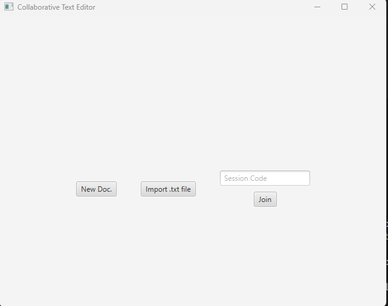
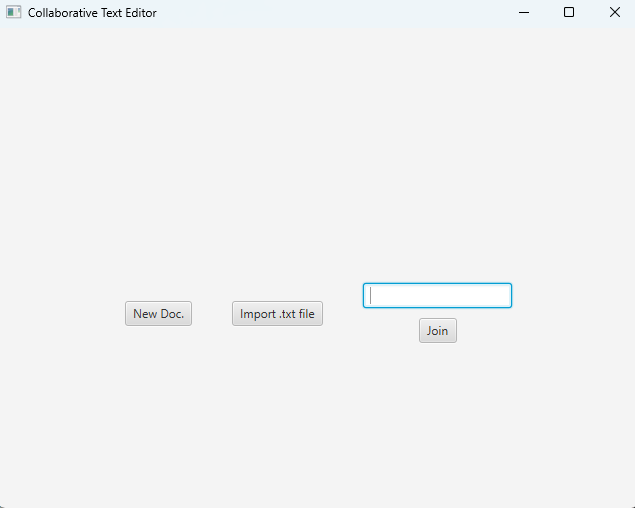
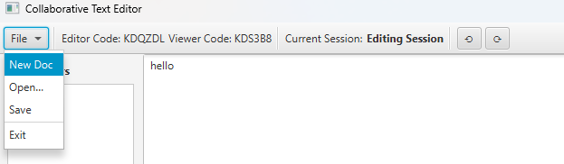
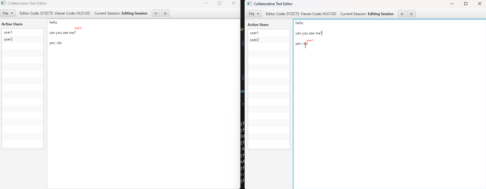

# 📝 Collaborative Plain Text Editor

A **real-time collaborative text editor** built in Java, featuring concurrency-safe editing, CRDT-based state management, and reconnection handling.  
The project combines a **JavaFX frontend** with a **Spring Boot backend** connected via **WebSocket** for real-time synchronization.

---

## ✨ Features

- **Real-Time Collaboration** 🖊️  
  Multiple users can edit the same document simultaneously with live updates.

- **CRDT Implementation** ⚡  
  Ensures consistent document state across clients without central conflicts.

- **Cursor Tracking** 🖱️  
  Each user’s cursor is visible to collaborators.

- **Undo/Redo** ↩️  
  Supports editing history actions for better usability.

- **Document Sharing Codes** 🔑  
  Documents can be shared with unique session codes.

- **File Import & Export** 📂  
  Supports loading from and saving to text files.

- **Reconnection Handling** 🔄  
  Users can disconnect and reconnect without losing document state.

---

## ⚙️ How to Run

### Backend
```bash
cd backend
mvn spring-boot:run
```

### Frontend
```bash
mvn clean javafx:run
```

---

## 📸 Screenshots







---

## 🧠 Known Issues & Suggestions

- **Memory Usage**: Long editing sessions may cause memory leaks due to object retention.  
- **File I/O Robustness**: Import/export handling needs stronger validation for corrupted or malformed files.  
- **Performance**: Large documents may suffer delays — further optimizations (batching WebSocket messages, reducing CRDT overhead) are suggested.  

---

## 🔧 Tech Stack

- **Java** – Core language  
- **JavaFX** – Frontend GUI  
- **Spring Boot** – Backend REST & WebSocket server  
- **WebSocket** – Real-time communication  
- **Maven** – Build & dependency management  

---

## 👤 Author

**Ahmed Mohamed**  
📧 [ahmed.mohamed04@hotmail.com](mailto:ahmed.mohamed04@hotmail.com)  
🔗 [LinkedIn Profile](https://www.linkedin.com/in/ahmed04/)

---

## 🏷️ Tags
`#Java` `#JavaFX` `#SpringBoot` `#WebSocket` `#CRDT` `#Collaboration` `#Maven`
